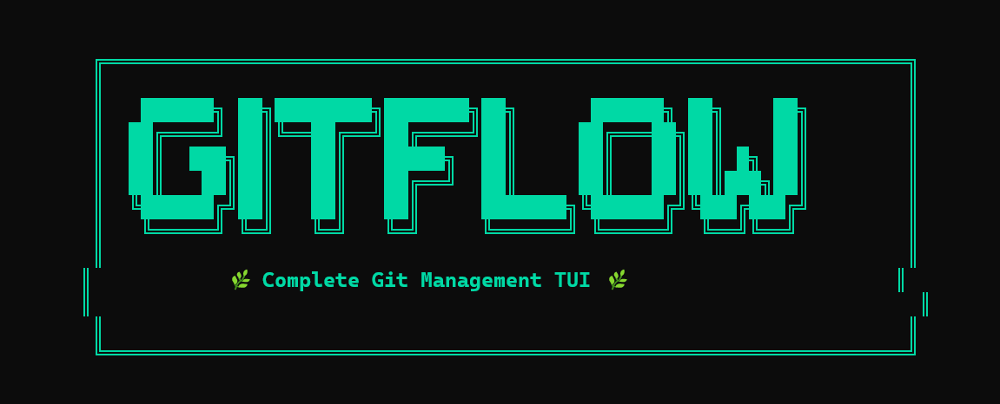

<div align="center">



<p>
  <strong>A Beautiful Terminal UI for Git</strong>
</p>

<p>
  <!-- Badges -->
  
  
  
</p>

<p>
  <a href="#features">Features</a> •
  <a href="#installation">Installation</a> •
  <a href="#usage">Usage</a> •
  <a href="#themes">Themes</a> •
  <a href="#screenshots">Screenshots</a>
</p>


</div>

---

## ✨ Features

<table>
<tr>
<td width="50%">

### 🎨 Visual Experience
- **ASCII Banner** with animated splash screen
- **Colorful Commit Graph** with unique branch colors
- **5 Distinctive Theme Colors**: Green • Teal • Blue • Firozi • Orange
- **Full Mouse Support** - click tabs, select items
- **Smooth Animations** and transitions

</td>
<td width="50%">

### 🚀 Git Operations
- **Complete Git Workflow**: commit, push, pull, fetch
- **Branch Management**: checkout, merge, rebase
- **Stash Operations**: save, pop, list
- **Tag Management**: create, list, delete
- **Visual Diff Viewer** with syntax highlighting

</td>
</tr>
<tr>
<td width="50%">

### 📊 Powerful Views
- **Dashboard**: Repository overview at a glance
- **Graph View**: Visual commit history with colors
- **Branch View**: All branches with ahead/behind info
- **Status View**: Color-coded staged/unstaged/untracked
- **Stash View**: Manage your stashes

</td>
<td width="50%">

### 🔧 Developer Friendly
- **Cross-Platform**: Windows, macOS, Linux, WSL
- **Editor Integration**: Neovim & VSCode plugins
- **Configurable**: JSON config with theme support
- **Lightweight**: Single binary, no dependencies
- **Fast**: Written in Go for performance

</td>
</tr>
</table>

---

## 📦 Installation

### Quick Install (One-Liner)

**Linux/macOS:**
```bash
curl -sSL https://raw.githubusercontent.com/VahajUrRehman/git-flow/main/install.sh | bash
```

**Windows (PowerShell):**
```powershell
irm https://raw.githubusercontent.com/VahajUrRehman/git-flow/main/install.ps1 | iex
```

### Package Managers

<table>
<tr>
<td width="33%">

**Homebrew (macOS/Linux)**
```bash
brew tap vahaj/gitflow
brew install gitflow-tui
```

</td>
<td width="33%">

**Scoop (Windows)**
```powershell
scoop bucket add gitflow https://github.com/VahajUrRehman/git-flow
scoop install gitflow-tui
```

</td>
<td width="33%">

**Go Install**
```bash
go install github.com/VahajUrRehman/git-flow/cmd/gitflow-tui@latest
```

</td>
</tr>
</table>

### Manual Download

Download the latest release for your platform:

| Platform | Architecture | Download |
|----------|--------------|----------|
| **Windows** | AMD64 | [⬇️ Download](https://github.com/VahajUrRehman/git-flow/releases/latest/download/gitflow-tui-windows-amd64.zip) |
| **Windows** | ARM64 | [⬇️ Download](https://github.com/VahajUrRehman/git-flow/releases/latest/download/gitflow-tui-windows-arm64.zip) |
| **macOS** | Intel | [⬇️ Download](https://github.com/VahajUrRehman/git-flow/releases/latest/download/gitflow-tui-darwin-amd64.tar.gz) |
| **macOS** | Apple Silicon | [⬇️ Download](https://github.com/VahajUrRehman/git-flow/releases/latest/download/gitflow-tui-darwin-arm64.tar.gz) |
| **Linux** | AMD64 | [⬇️ Download](https://github.com/VahajUrRehman/git-flow/releases/latest/download/gitflow-tui-linux-amd64.tar.gz) |
| **Linux** | ARM64 | [⬇️ Download](https://github.com/VahajUrRehman/git-flow/releases/latest/download/gitflow-tui-linux-arm64.tar.gz) |

<details>
<summary><b>📋 Manual Installation Steps</b></summary>

**Windows:**
```powershell
# Download and extract
Expand-Archive gitflow-tui-windows-amd64.zip -DestinationPath C:\Tools

# Add to PATH or move to existing PATH folder
Move-Item C:\Tools\gitflow-tui-windows-amd64.exe C:\Windows\System32\gitflow-tui.exe
```

**macOS/Linux:**
```bash
# Extract
tar -xzf gitflow-tui-linux-amd64.tar.gz

# Make executable and move to PATH
chmod +x gitflow-tui-linux-amd64
sudo mv gitflow-tui-linux-amd64 /usr/local/bin/gitflow-tui
```

**WSL:**
```bash
# From Windows, copy to WSL
cp /mnt/c/path/to/gitflow-tui-linux-amd64 /usr/local/bin/gitflow-tui
chmod +x /usr/local/bin/gitflow-tui
```

</details>

---

## 🚀 Usage

### Getting Started

```bash
# Navigate to any git repository
cd my-project

# Launch GitFlow TUI
gitflow-tui
```

### Keyboard Shortcuts

| Key | Action |
|-----|--------|
| `↑` `↓` `←` `→` / `k` `j` `h` `l` | Navigate |
| `Enter` | Select / Open |
| `Tab` | Next tab |
| `Shift+Tab` | Previous tab |
| `Space` | Stage / Unstage file |
| `r` | Refresh |
| `?` | Help |
| `q` / `Ctrl+C` | Quit |

### Mouse Support

- **Click tabs** to switch views
- **Click commits** to view details
- **Click files** to stage/unstage
- **Click branches** to checkout

### Command Mode

Press `:` to enter command mode:

| Command | Description |
|---------|-------------|
| `:commit` | Create commit |
| `:push` | Push to remote |
| `:pull` | Pull from remote |
| `:checkout <branch>` | Checkout branch |
| `:merge <branch>` | Merge branch |
| `:stash` | Stash changes |
| `:tag <name>` | Create tag |

---

## 🎨 Themes

GitFlow TUI comes with a beautiful **5-color theme** inspired by nature:

<div align="center">

| Color | Hex | Usage |
|-------|-----|-------|
|  **Green** | `#00D9A5` | Primary, success, current branch |
|  **Teal** | `#00B4A6` | Secondary, staged files |
|  **Blue** | `#0091EA` | Tertiary, commit hashes |
|  **Firozi** | `#00E5FF` | Accent, selected items |
|  **Orange** | `#FF6D00` | Highlight, warnings, current branch |

</div>

### Custom Configuration

Create `~/.config/gitflow-tui/config.json`:

```json
{
  "theme": {
    "name": "gitflow",
    "colors": {
      "primary": "#00D9A5",
      "secondary": "#00B4A6",
      "tertiary": "#0091EA",
      "accent": "#00E5FF",
      "highlight": "#FF6D00",
      "background": "#0D1117",
      "foreground": "#E6EDF3"
    }
  },
  "graph_style": "unicode",
  "mouse_enabled": true,
  "animations": true
}
```

---

## 📸 Screenshots

<div align="center">

### 🏠 Dashboard View


### 📊 Graph View


### 🌿 Branch View


### 📁 Status View


</div>

---

## 🛠️ Building from Source

### Prerequisites
- Go 1.21 or later
- Git

### Build

```bash
# Clone repository
git clone https://github.com/VahajUrRehman/git-flow.git
cd git-flow

# Build for current platform
go build -o build/gitflow-tui ./cmd/gitflow-tui

# Or use Make to build for all platforms
make build-all
```

See [BUILD_GUIDE.md](BUILD_GUIDE.md) for complete build instructions.

---

## 🔌 Editor Integration

### Neovim

```lua
-- Using lazy.nvim
{
  'VahajUrRehman/git-flow',
  config = function()
    require('gitflow').setup()
  end
}
```

### VSCode

Search for "GitFlow TUI" in the Extensions marketplace or install from [VSIX](editors/vscode/).

---

## 📚 Documentation

| Document | Description |
|----------|-------------|
| [QUICKSTART.md](QUICKSTART.md) | Get started in 5 minutes |
| [BUILD_GUIDE.md](BUILD_GUIDE.md) | Build from source |
| [CONTRIBUTING.md](CONTRIBUTING.md) | Contribute to project |
| [CHANGELOG.md](CHANGELOG.md) | Version history |

---

## 🤝 Contributing

Contributions are welcome! Please read our [Contributing Guide](CONTRIBUTING.md) for details.

```bash
# Fork and clone
git clone https://github.com/yourusername/git-flow.git

# Create branch
git checkout -b feature/amazing-feature

# Commit changes
git commit -m "feat: add amazing feature"

# Push
git push origin feature/amazing-feature

# Open Pull Request
```

---

## 📄 License

This project is licensed under the **MIT License** - see [LICENSE](LICENSE) file.

---

## 🙏 Acknowledgments

- Built with [Bubble Tea](https://github.com/charmbracelet/bubbletea) - The TUI framework
- Styled with [Lipgloss](https://github.com/charmbracelet/lipgloss) - Style definitions
- Inspired by [LazyGit](https://github.com/jesseduffield/lazygit) and [GitUI](https://github.com/extrawurst/gitui)

---

<div align="center">

<p>
  <sub>Made with ❤️ by <a href="https://github.com/VahajUrRehman">Vahaj Ur Rehman</a></sub>
</p>

<p>
  <a href="https://github.com/VahajUrRehman/git-flow/stargazers">⭐ Star this repo</a> •
  <a href="https://github.com/VahajUrRehman/git-flow/issues">🐛 Report bug</a> •
  <a href="https://github.com/VahajUrRehman/git-flow/issues">💡 Request feature</a>
</p>

</div>
